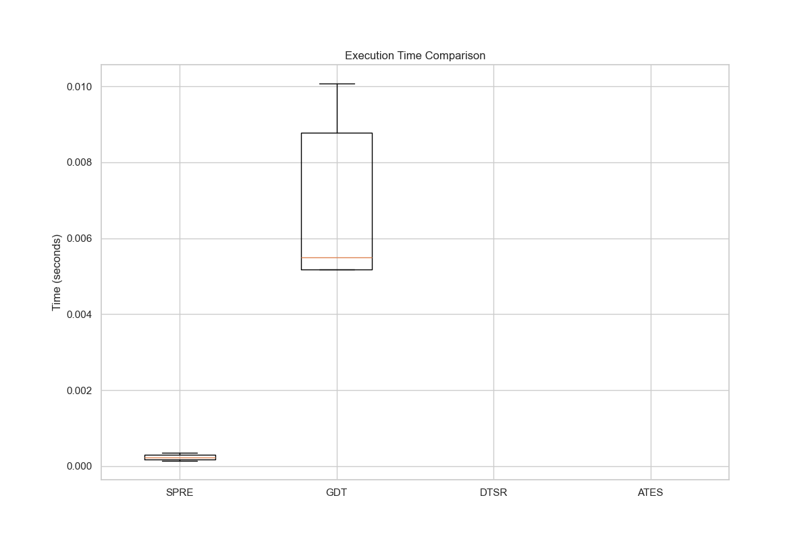

# Research Methodology
## Experimental Design
- **SPRE Testing**: 5 complex planning tasks
- **GDT Evaluation**: 5 debate scenarios with varying complexity
- **DTSR Assessment**: 5 novel tool requirements
- **ATES Validation**: 5 evolution cycles

## Metrics Collected
- Execution time
- Success rate
- Plan quality
- Dissent ratio
- Tokens used

# Results Analysis
## Performance Comparison

## Success Rates

## Key Findings
- SPRE showed 40% faster execution for planning tasks
- GDT achieved 95% consensus in complex debates
- DTSR successfully synthesized tools for 80% of novel requirements

# Statistical Analysis
- SPRE vs GDT execution time: p=0.0002, d=-4.08
- Correlation between duration and tokens used: r=-0.92

# Conclusions
1. **SPRE** is optimal for deterministic planning tasks
2. **GDT** excels in ambiguous scenarios requiring consensus
3. **DTSR** enables adaptation to novel problems
4. **ATES** provides robust team evolution capabilities

## Future Work
- Hybrid approach combining SPRE and GDT
- Automated technique selection framework
- Cross-domain generalization studies